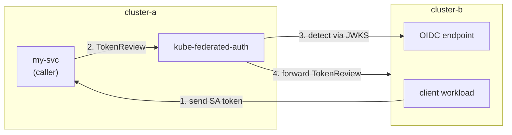

# kube-federated-auth

[](https://github.com/rophy/kube-federated-auth/actions/workflows/ci.yaml)

Federated ServiceAccount authentication across Kubernetes clusters.

Validate ServiceAccount tokens from multiple Kubernetes clusters using their OIDC endpoints. Enables cross-cluster workload authentication without service meshes or additional identity infrastructure.

## How It Works

There are three roles in the flow:

- **Client workload** — a workload on a remote cluster that presents its SA token to authenticate
- **Caller service** — your service (e.g. an API gateway) that receives the token and needs to verify it. This is the service that calls kube-federated-auth.
- **kube-federated-auth** — verifies the token by detecting the source cluster and forwarding a TokenReview



1. A **client workload** sends its ServiceAccount token to your service
2. Your **caller service** calls kube-federated-auth using standard Kubernetes [TokenReview API](https://kubernetes.io/docs/reference/kubernetes-api/authentication-resources/token-review-v1/)
3. kube-federated-auth detects the source cluster by verifying the JWT signature against cached JWKS (local, no token leakage)
4. kube-federated-auth forwards the TokenReview to the detected cluster for authoritative validation (revocation checks, bound object validation)

## Installation

```bash
docker pull ghcr.io/rophy/kube-federated-auth:latest
```

## Quick Start

```bash
# Run locally
go run ./cmd/server --config=config/clusters.yaml

# Or with Docker
docker run -v $(pwd)/config:/etc/kube-federated-auth ghcr.io/rophy/kube-federated-auth
```

## Configuration

```yaml
# config/clusters.yaml
# Caller services allowed to use the kube-federated-auth API (see "Caller
# Authentication" below). These are your services (e.g. my-svc in the diagram
# above) — not the client workloads whose tokens are being reviewed.
# Format: {cluster}/{namespace}/{serviceaccount}, * as wildcard.
authorized_clients:
  - "cluster-a/kube-federated-auth/my-svc"       # exact caller
  - "cluster-a/*/my-app"                          # my-app in any namespace
  - "cluster-a/kube-federated-auth/*"             # any caller in namespace

renewal:
  interval: "1h"          # How often to check for renewal
  token_duration: "168h"  # Requested token TTL (7 days)
  renew_before: "48h"     # Renew when <48h remaining

clusters:
  # EKS cluster (public OIDC endpoint, no credentials needed)
  eks-prod:
    issuer: "https://oidc.eks.us-west-2.amazonaws.com/id/EXAMPLE"

  # Remote cluster with private OIDC (requires credentials)
  cluster-b:
    issuer: "https://kubernetes.default.svc.cluster.local"
    api_server: "https://cluster-b.example.com:6443"
    ca_cert: "/etc/kube-federated-auth/certs/cluster-b-ca.crt"
    token_path: "/etc/kube-federated-auth/certs/cluster-b-token"
```

## Caller Authentication

`authorized_clients` restricts which **caller services** (like `my-svc` in the diagram) can use the kube-federated-auth API. It does **not** control which client workloads' tokens can be reviewed — any token from a configured cluster can be reviewed regardless of this setting.

By default, the TokenReview endpoint is open to any caller. When `authorized_clients` is configured, caller services must include their own ServiceAccount token in the `Authorization` header:

```bash
# The caller (my-svc) authenticates itself via the Authorization header,
# and asks kube-federated-auth to review a client workload's token in the body.
curl -X POST http://kube-federated-auth:8080/apis/authentication.k8s.io/v1/tokenreviews \
  -H "Authorization: Bearer <caller-service-sa-token>" \
  -H "Content-Type: application/json" \
  -d '{ "spec": { "token": "<client-workload-token>" } }'
```

The caller's token is verified via JWKS (same as regular token detection) and checked against the `authorized_clients` list. If omitted or unauthorized, the request is rejected with `401` or `403`.

## RBAC Requirements

### Caller services

Caller services (e.g. `my-svc`) do **not** need any special RBAC. They only need a ServiceAccount — their token is verified by kube-federated-auth via JWKS, not through the Kubernetes API.

### Server cluster (where kube-federated-auth runs)

The server's ServiceAccount needs:

| Resource | Verbs | Scope | Reason |
|----------|-------|-------|--------|
| `tokenreviews` | `create` | ClusterRole | Forward TokenReview requests to the local API server |
| `secrets` | `get`, `create`, `update` | Role (namespaced) | Persist renewed credentials for remote clusters |

### Remote clusters (whose tokens are validated)

A ServiceAccount on each remote cluster needs:

| Resource | Verbs | Scope | Reason |
|----------|-------|-------|--------|
| `tokenreviews` | `create` | ClusterRole | Allow the server to forward TokenReview requests |
| `serviceaccounts/token` | `create` | Role (namespaced) | Allow the server to request tokens for credential renewal |

The server authenticates to remote clusters using a bootstrap token (provided via `token_path` in config). On first startup, it reads this bootstrap token and uses it to request a new token via the remote cluster's TokenRequest API. The renewed token is persisted to a Kubernetes Secret, and subsequent renewals use the stored token — the bootstrap token file is only read again if the Secret is missing or empty for that cluster. CA certificates are not renewed — they are read once from `ca_cert` at startup.

## API

### POST /apis/authentication.k8s.io/v1/tokenreviews

Standard Kubernetes TokenReview API. The source cluster is automatically detected via JWKS signature verification — no cluster-specific routing needed.

```bash
curl -X POST http://kube-federated-auth:8080/apis/authentication.k8s.io/v1/tokenreviews \
  -H "Content-Type: application/json" \
  -H "Authorization: Bearer <caller-service-sa-token>" \
  -d '{
    "apiVersion": "authentication.k8s.io/v1",
    "kind": "TokenReview",
    "spec": {
      "token": "<client-workload-token>"
    }
  }'
```

- `Authorization` header — the caller service's own SA token (required when `authorized_clients` is configured; omit if not)
- `spec.token` — the client workload's token to review

**Success response:**

```json
{
  "apiVersion": "authentication.k8s.io/v1",
  "kind": "TokenReview",
  "status": {
    "authenticated": true,
    "user": {
      "username": "system:serviceaccount:default:my-app",
      "uid": "abc-123",
      "groups": [
        "system:serviceaccounts",
        "system:serviceaccounts:default",
        "system:authenticated"
      ],
      "extra": {
        "authentication.kubernetes.io/cluster-name": ["cluster-b"]
      }
    }
  }
}
```

The `extra["authentication.kubernetes.io/cluster-name"]` field indicates which cluster the token was validated against.

**Error response:**

```json
{
  "apiVersion": "authentication.k8s.io/v1",
  "kind": "TokenReview",
  "status": {
    "authenticated": false,
    "error": "token not valid for any configured cluster"
  }
}
```

### GET /clusters

List configured clusters and their credential status.

```json
{
  "clusters": [
    {
      "name": "eks-prod",
      "issuer": "https://oidc.eks.us-west-2.amazonaws.com/id/EXAMPLE"
    },
    {
      "name": "cluster-b",
      "issuer": "https://kubernetes.default.svc.cluster.local",
      "api_server": "https://cluster-b.example.com:6443",
      "token_status": {
        "expires_at": "2025-12-21T13:26:40Z",
        "expires_in": "167h50m4s",
        "status": "valid"
      }
    }
  ]
}
```

### GET /health

```json
{"status":"ok"}
```

## Environment Variables

### kube-federated-auth server

| Variable | Default | Description |
|----------|---------|-------------|
| `CONFIG_PATH` | `config/clusters.yaml` | Path to config file |
| `PORT` | `8080` | Server port |
| `NAMESPACE` | `kube-federated-auth` | Namespace for credential secret |
| `SECRET_NAME` | `kube-federated-auth` | Secret name for credentials |

## Testing

```bash
make test          # unit + e2e
make test-unit     # Go unit tests
make test-e2e      # bats e2e tests (requires Kind clusters)
make test-perf     # k6 performance tests (requires Kind clusters)
```

See [test/README.md](test/README.md) for details on each test suite.

## Troubleshooting

### `401 caller token missing identity claims`

The caller service's token was verified via JWKS but doesn't contain the `kubernetes.io` claims (namespace and service account name). This typically means the caller is using a **legacy ServiceAccount token** (static Secret-based) instead of a **projected ServiceAccount token** (bound, time-limited).

**Fix:** Ensure the caller pod uses a projected token. Most clusters create these by default (Kubernetes 1.21+). If the caller's token comes from a Secret of type `kubernetes.io/service-account-token`, it won't have the required claims — use a projected volume or `kubectl create token <sa-name>` instead.

### `401 caller token not valid for any configured cluster`

The caller's SA token could not be verified against any cluster's JWKS. Common causes:

- The caller's cluster is not listed in `clusters:` in the config
- The cluster's `issuer` doesn't match the token's `iss` claim
- The JWKS endpoint is unreachable (network policy, firewall, or wrong `api_server` URL)

### `403 caller is not authorized`

The caller's token was verified and identity extracted, but it doesn't match any entry in `authorized_clients`. The log will show the caller's identity as `{cluster}/{namespace}/{serviceaccount}` — check it matches one of your whitelist entries.

### `token not valid for any configured cluster` (for the reviewed token)

The client workload's token (in `spec.token`) couldn't be matched to any configured cluster. Check:

- The client workload's cluster is listed in `clusters:` config
- The `issuer` matches the token's `iss` claim (run `kubectl get --raw /.well-known/openid-configuration` on the client's cluster to find the issuer)

### `401 Authorization header required`

You have `authorized_clients` configured but the caller didn't send an `Authorization: Bearer <token>` header. Either add the header, or remove `authorized_clients` from the config if you don't need caller authentication.

### Setup checklist

Three things to configure correctly:

1. **`clusters:`** — each remote cluster needs `issuer` (must match exactly). Private clusters also need `api_server`, `ca_cert`, and `token_path`.
2. **`authorized_clients:`** (optional) — lists caller services allowed to use the API, in `{cluster}/{namespace}/{serviceaccount}` format. Omit to allow any caller.
3. **RBAC** — kube-federated-auth's own SA needs `tokenreviews` (ClusterRole) and `secrets` (namespaced Role). Remote cluster SAs need `tokenreviews` (ClusterRole) and `serviceaccounts/token` (namespaced Role).

## License

MIT
